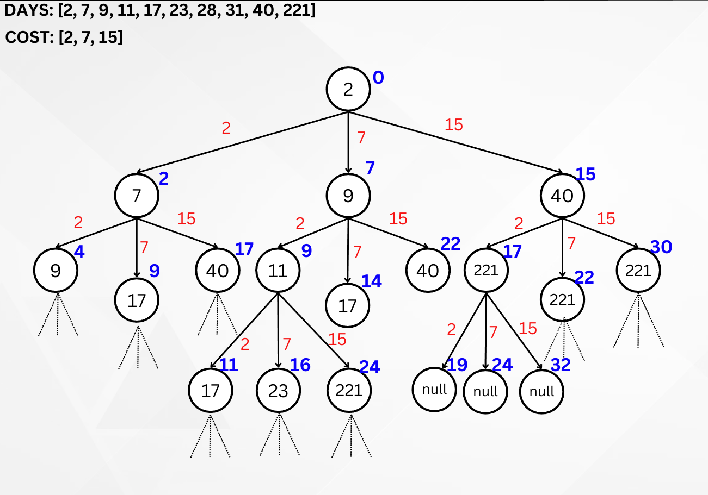

# Minimum Cost of Ticket

[](https://github.com/DILPREET1910/minimum-cost-of-ticket/releases)

This application is based on
the [leetcode problem minimum cost of ticket](https://leetcode.com/problems/minimum-cost-for-tickets/description/)
,that helps users find the minimum cost of travel using 1-day, 7-day, and 30-day passes.

# Features

- Allows users to input days they want to travel
- Allows users to input cost of each 1-day, 7-days and 30-days travel passes
- Calculates the minimum cost
- Not only that but also shows all the possible paths to travel at minimum cost

# Getting Started

## Prerequisites

- [Flutter SDK](https://docs.flutter.dev/get-started/install)
- [Firebase](https://firebase.google.com/)

## Clone Repository

```shell
cd project_directory
git clone https://github.com/DILPREET1910/minimum-cost-of-ticket
```

## Customisation

In this Flutter project, all code related to the UI and Firebase backend is organised under
the `lib/` directory. Each file within this directory is meticulously commented and named according
to its specific use case. This structured approach ensures that understanding the functionality of
each part of the codebase is straightforward.

The code of calculating minimum cost and its paths is located
at `lib/services/minimumCostOfTicket.dart` file

## Logic



1. **Date Conversion**:
    - The user-selected travel dates are converted into day-of-year values and stored in a list. For
      example, dates like 1 Jan 2023, 3 Jan 2023, 31 Jan 2023, 1 Feb 2023, 6 Feb 2023 are
      transformed into the list [1, 3, 31, 32, 37].
2. **Cost Storage**:
    - The costs for 1-day, 7-days, and 30-days travel options are stored in a list, where the 0th
      index corresponds to the cost of 1-day travel, the 1st index corresponds to the cost of 7-days
      travel, and the 2nd index corresponds to the cost of 30-days travel.

3. **Decision Tree Creation**:
    - A decision tree is constructed based on the provided travel dates and costs as shown in the
      above image. This tree represents the various possible combinations of travel options for
      minimizing the overall cost. Each node in the tree represents a state in which the traveler
      must decide between different pass options.

4. **Completion List**:
    - Nodes that have completed all the days of travel (i.e., they have no further decisions to
      make) are identified and stored in a separate list. These nodes represent complete travel
      paths.

5. **Minimum Path Selection**:
    - From the list of completed travel paths, the application identifies the minimum total cost and
      displays all the possible path/s to travel at minimum possible cost.

*While it's acknowledged that the time and space complexity of this application could have been
notably improved through the implementation of dynamic programming, the project was undertaken as
part of my college curriculum requirement for the Advanced Data Structures course. As per the course
guidelines, it was mandatory to employ tree data structures.*

Nevertheless, there's an opportunity to enhance the time complexity by incorporating a caching
mechanism into the existing decision tree logic.

## Contributing

Contributions are most welcome! If you find any issues or have suggestions for improvements, please
feel
free to [open an issue](https://github.com/DILPREET1910/minimum-cost-of-ticket/issues)
or [create a pull request](https://github.com/DILPREET1910/minimum-cost-of-ticket/pulls)

# Acknowledgements

flutter libraries used from [pub.dev](https://pub.dev)\
[cupertino_icons](https://pub.dev/packages/cupertino_icons)\
[syncfusion_flutter_datepicker](https://pub.dev/packages/syncfusion_flutter_datepicker)\
[jiffy](https://pub.dev/packages/jiffy)\
[google_fonts](https://pub.dev/packages/google_fonts)\
[intl](https://pub.dev/packages/intl)
